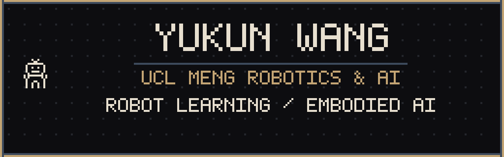

  

<h2 align="center">Yukun Wang</h2>

  Robot Learning · Embodied AI 
  MEng Robotics &amp; AI @ <a href="https://www.ucl.ac.uk/">UCL</a>

  <a href="https://lbtwyk.github.io"> Website</a>
  &nbsp;·&nbsp;
  <a href="mailto:lambert.wang.23@ucl.ac.uk"> Mail</a>
  &nbsp;·&nbsp;
  <a href="https://github.com/lbtwyk"> GitHub</a>
  &nbsp;·&nbsp;
  <a href="https://www.linkedin.com/in/yukun-wang-024120297/"> LinkedIn</a>

  

<h3> About</h3>

Fourth-year MEng Robotics & AI at UCL. I build robots that learn from demonstrations and act in the world, working across robot learning, autonomous manipulation, and music-driven motion.

<h3> Projects</h3>

**UBTECH · From demonstrations to autonomous action**

I built an automated demonstration pipeline for UTars, developed recovery from off-nominal states, and connected robot learning with autonomous manipulation in simulation. The work connects data generation, learning, and autonomous execution in one complete workflow.

**Collection — Fully Automated:** planning, execution, and recovery without manual teleoperation. 
**Inference — Autonomous Decision-Making:** the model observes the scene and independently decides how to execute the instructed task.

<h3> Research & experience</h3>

- **2026 — Present · UBTECH** — Research intern, Embodied Large Models & Cognitive Decision. Automated demonstrations, robot learning, and autonomous manipulation.
- **2025.06 — 2025.10 · Tsinghua IIIS × Zhongguancun Academy** — Research intern in robot learning and sim-to-real: real-robot data, diffusion policies, and joint learning from simulated and real demonstrations.
- **Ongoing** — Streaming music-conditioned dance generation for humanoid robots, connecting rhythm and continuous movement.

**Robot Learning · Embodied AI · Autonomous Manipulation · Sim to Real · Music to Motion**
